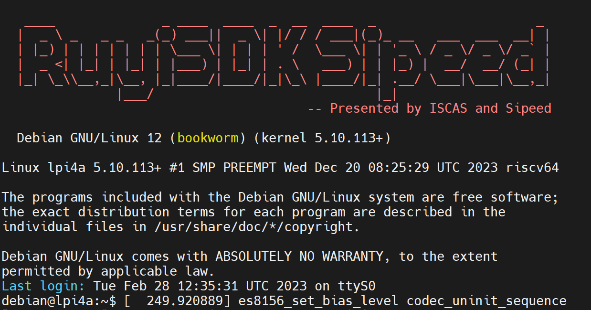
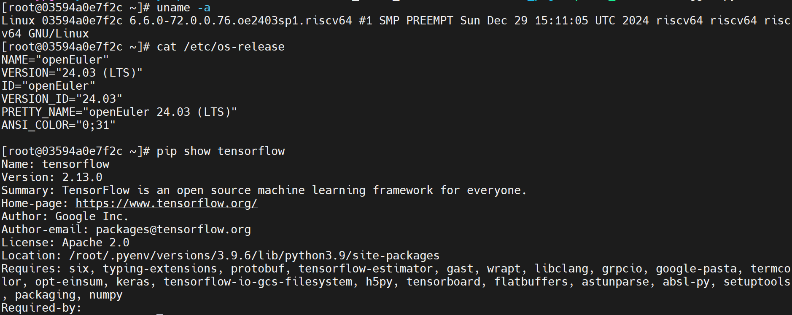

# LicheePi 4A Startup

> 感谢甲辰计划RISC-V开发板随缘漂流计划，我申请到了LicheePi 4A 16GB RAM + 128GB eMMC，这里是[Github仓库](https://github.com/rv2036/riscv-board-wandering)。
>
> 本文主要记录如何进入黑窗口、烧录新系统和从源码构建Tensorflow。

## 0 进入黑窗口

1. 查阅sipeed的[文档](https://wiki.sipeed.com/hardware/zh/lichee/th1520/lpi4a/2_unbox.html)，按照说明安装散热硅脂和散热风扇；
2. 将开发板上的 `VIN:12V`连接电源，此时开发板上的红灯亮起，风扇旋转；
3. 通过RV Debugger PLUS将模块的 `TX`连接开发板的 `U0-RX`，模块的 `RX`连接开发板的 `U0-TX`，模块的两个 `GND`连接开发板的两个 `GND`，然后将模块和笔记本连接，此时模块上的红灯亮起；
4. 在Windows中打开设备管理器，找到端口，查看是COM几；
5. 在MobaXterm中新建一个session是serial，Serial Port选择刚才查看到的COM，Speed选择115200，然后连接即可；
6. 此时就进入了LicheePi 4A的终端，可以通过debian用户名，debian密码进行登录。



## 1 烧录新系统

这里以烧录OERV为例，新系统下载[来源](https://images.oerv.ac.cn/board?uri=products/sipeed/licheepi_4a.json&name=LicheePi+4A)，Windows驱动安装[参考](https://wiki.sipeed.com/hardware/zh/lichee/th1520/lpi4a/4_burn_image.html#Windows-%E4%B8%8B%E9%A9%B1%E5%8A%A8%E5%AE%89%E8%A3%85%28%E7%A6%81%E7%94%A8%E9%A9%B1%E5%8A%A8%E7%AD%BE%E5%90%8D%29)，也可以直接下载[这个](https://github.com/6eanut/temp/releases/download/licheepi4a_oerv24.03-lts-sp1_th1520-bluetooth/licheepi4a_oerv24.03-lts-sp1.zip)。以上执行好之后，便可以开始烧录新系统了。

```shell
LPI4A_RAM_VARIANT='-16g'
OERV_VERSION='24.03-LTS-SP1'
zstd -d openEuler-${OERV_VERSION}-riscv64-lpi4a-base-boot.ext4.zst
zstd -d openEuler-${OERV_VERSION}-riscv64-lpi4a-base-root.ext4.zst
fastboot flash ram u-boot-with-spl-lpi4a${LPI4A_RAM_VARIANT}.bin
fastboot reboot
sleep 1
fastboot flash uboot u-boot-with-spl-lpi4a${LPI4A_RAM_VARIANT}.bin
fastboot flash boot openEuler-${OERV_VERSION}-riscv64-lpi4a-base-boot.ext4
fastboot flash root openEuler-${OERV_VERSION}-riscv64-lpi4a-base-root.ext4
```

然后重启开发板，以root用户登录，密码是openEuler12#$

### 1-1 wifi设置

因为板卡上的网卡型号是AIC8800，而OERV24.03-LTS-SP1目前还不支持，所以需要安装th1520-bluetooth固件rpm包，参考[这里](https://gitee.com/openeuler/RISC-V/issues/IBXGED)。

1. th1520-bluetooth固件rpm包，源码在[这里](https://build.tarsier-infra.isrc.ac.cn/package/show/home:6eanut:branches:Factory:Board:TH1520/th1520-bluetooth)，可以通过qemu进行构建，qemu搭建方式在[这里](https://6eanut.github.io/NOTEBOOK/25-Q1/03_qemu_oerv.html)，obs构建可以参考[这里](https://6eanut.github.io/NOTEBOOK/24-Q3/build-bazel-riscv.html)；
2. 在Windows下可以通过[minitool partition wizard](https://www.partitionwizard.jp/free-partition-manager.html)将U盘格式化为ext4，通过[ext4fds](https://github.com/bobranten/Ext4Fsd)将构建的rpm包拷入U盘；
3. 将U盘插入板卡，挂载U盘，并进行安装。

```shell
# 挂载u盘
mkdir /mnt/usb
mount /dev/sda1 /mnt/usb

dnf install --disablerepo=* ./th1520-bluetooth-2.0-2.oe2403.riscv64.rpm

nmcli device status 						#查看wlan
nmcli device wifi list 						#查看可用wifi
nmcli device wifi connect "WiFi名称" password "WiFi密码" 	#连接wifi
ping baidu.com							#检查网络
nmcli connection modify "check" connection.autoconnect yes	#设置自动连接wifi
nmcli connection show "check" | grep autoconnect		#检查设置结果

#可以关闭wifi或重启板卡检测是否能自连wifi
```

访问Github的方法可以参考[cnNetTool](https://github.com/sinspired/cnNetTool)

### 1-2 风扇设置

发现当CPU利用率较高时，风扇转速较快，而当CPU利用率下降时，风扇转速会变小，同时噪音会变小(不知道为什么)，所以这里强制设置风扇转速为最大。

风扇转速：/sys/class/hwmon/hwmon0/pwm1；按照如下方式启动好systemd服务后，可以通过/var/log/force_pwm.log来查看风扇重置记录。

编写force_pwm.sh脚本：

```shell
#!/bin/bash

# 定义PWM路径
PWM_PATH="/sys/class/hwmon/hwmon0/pwm1"
ENABLE_PATH="/sys/class/hwmon/hwmon0/pwm1_enable"

# 确保手动模式
echo 1 | tee $ENABLE_PATH > /dev/null

# 持续监控
while true; do
    CURRENT_PWM=$(cat $PWM_PATH)
    if [ "$CURRENT_PWM" -ne 255 ]; then
        echo 255 | tee $PWM_PATH > /dev/null
        echo "$(date): PWM1 被重置为 255（原值：$CURRENT_PWM）" >> /var/log/force_pwm.log
    fi
    sleep 5  # 每5秒检查一次
done
```

创建systemd服务并启动：

```shell
# 创建服务文件
sudo tee /etc/systemd/system/force_pwm.service <<EOF
[Unit]
Description=Force PWM1 to 255
After=multi-user.target

[Service]
ExecStart=/bin/bash /root/mysystemd/force_pwm.sh
Restart=always
User=root

[Install]
WantedBy=multi-user.target
EOF

# 启动并设置开机自启
sudo systemctl daemon-reload
sudo systemctl start force_pwm
sudo systemctl enable force_pwm
```

## 2 从源码构建Tensorflow

obs环境搭建参考[这里](https://6eanut.github.io/NOTEBOOK/24-Q3/build-bazel-riscv.html)，先构建[bazel](https://build.tarsier-infra.isrc.ac.cn/package/show/home:6eanut:branches:openEuler:24.03/bazel)，后构建[tensorflow](https://github.com/tensorflow/tensorflow.git)，在tf构建前需要安装python3.9.6，并安装[requirements_1.txt](oerv-tf/requirements_1.txt)，tf构建后安装[requirements_2.txt](oerv-tf/requirements_2.txt)。

```shell
# 构建并安装bazel5.3.0
osc co home:6eanut:branches:openEuler:24.03/bazel
cd home\:6eanut\:branches\:openEuler\:24.03/bazel/
osc up -S
rm -f _service;for file in `ls | grep -v .osc`;do new_file=${file##*:};mv $file $new_file;done
osc build
dnf install /var/tmp/build-root/mainline_riscv64-riscv64/home/abuild/rpmbuild/RPMS/riscv64/bazel-5.3.0-2.oe2403.riscv64.rpm -y

# 从源码构建tensorflow2.13.0
git clone https://github.com/tensorflow/tensorflow.git
cd tensorflow
git checkout tags/v2.13.0
# 将.bazelrc中的build --define=with_xla_support=true改为false，build:linux --define=build_with_onednn_v2=true改为false
./configure
bazel build //tensorflow/tools/pip_package:build_pip_package --define=build_with_mkl=false --define=enable_mkl=false --define=tensorflow_mkldnn_contraction_kernel=0 --define=build_with_mkl_dnn_v1_only=false --define=tensorflow_use_mkldnn=false --define=build_with_openmp=false
WORKSPACE=$(pwd)
./bazel-bin/tensorflow/tools/pip_package/build_pip_package $WORKSPACE/../tensorflow_pkg
pip install $WORKSPACE/../tensorflow_pkg/tensorflow* --no-deps
```



---

## 20250628

在Mac本上面，可以通过VSCode的Serial Moniter插件通过串口连接到开发板。

将开发板连接到Mac之后，可以在终端里面看是否有/dev/tty.usbserial-XXXX或/dev/cu.usbserial-XXXX，有的话说明检测到了。


然后就可以进入到终端了。

串口调试主要是连上wifi，然后就可以通过ssh连接到开发板了。

```txt
Host lp4a
    HostName 192.168.0.108       # 通过ifconfig查看wlan0的inet是多少
    Port 22
    User root
```
