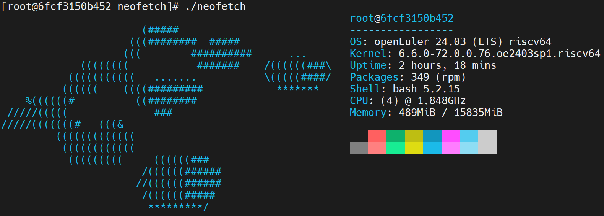
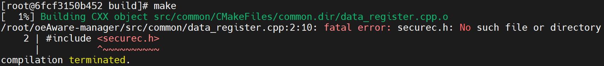
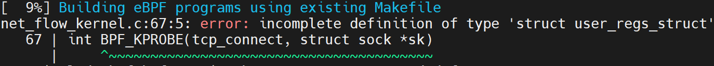
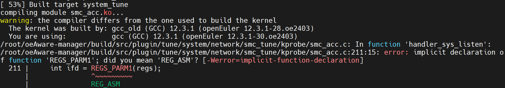
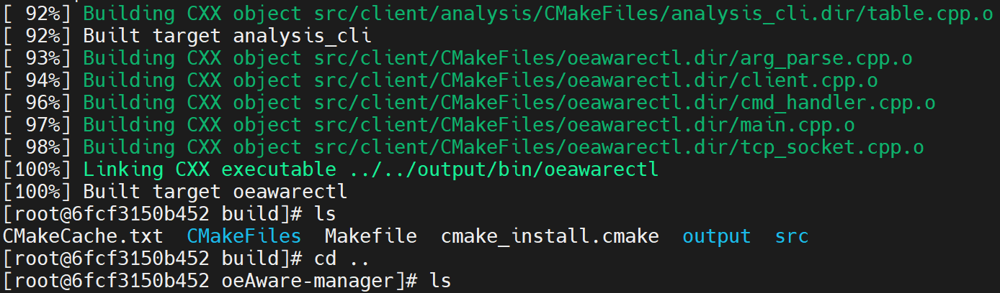
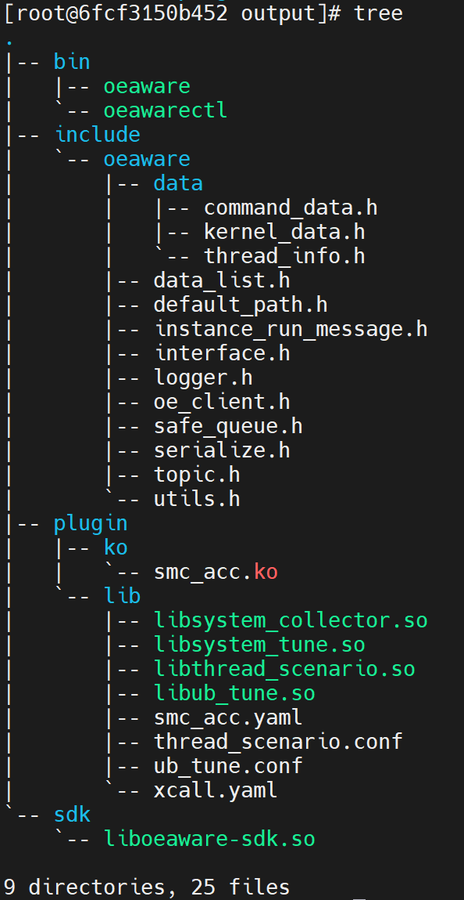
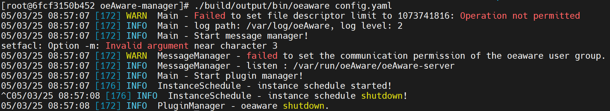
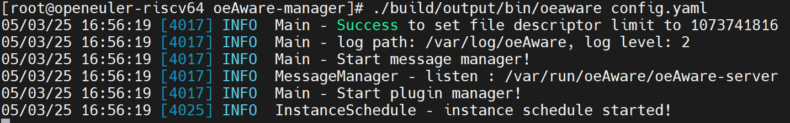
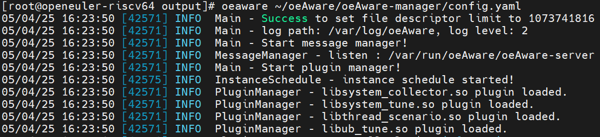
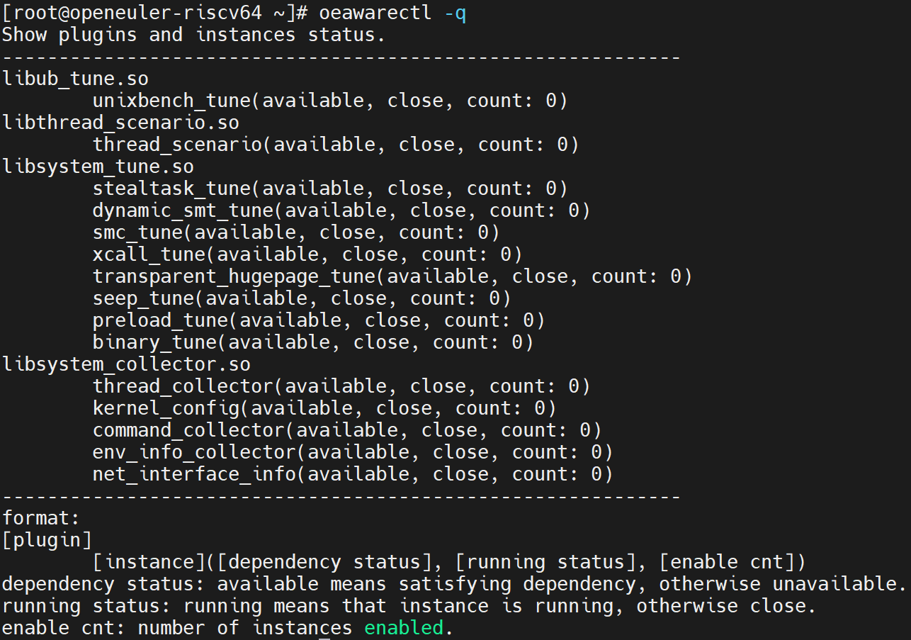

# oeAware

在开源之夏里面看到了“基于 RISC-V 架构的 oeAware 框架移植”这个项目，故而决定试一试。

注：向openeuler/oeAware-manager社区提交的pr已被[合并](https://gitee.com/openeuler/oeAware-manager/pulls/172)。

## 0 啥是oeAware

oeAware是针对于openEuler的一个工具，是一个采集-感知-调优框架，智能感知系统行为并进行调优。传统的方法都是开关某个操作，而oeAware可以将这个过程智能化。比如使多核负载均衡、减少远端内存访问等。

上面是我自己的理解，下面是官方简介：

**oeAware是在openEuler上实现低负载采集感知调优的框架，目标是动态感知系统行为后智能使能系统的调优特性。传统调优特性都以独立运行且静态打开关闭为主，oeAware将调优拆分采集、感知和调优三层，每层通过订阅方式关联，各层采用插件式开发尽可能复用。**

## 1 适配过程

### 1-1 环境配置

采用oerv的docker作为开发环境，这样可以避免破坏主机的环境，因为适配过程中可能涉及到不同版本的包。



安装工具包：

```shell
dnf install -y git cmake make gcc-c++ boost-devel curl-devel log4cplus-devel yaml-cpp-devel gtest-devel gmock-devel clang libbpf-devel bpftool numactl-devel libnl3-devel kernel-devel sudo graphviz
```

### 1-2 编译

#### 1-2-1 编译流程

```shell
git clone git@gitee.com:openeuler/oeAware-manager.git
cd oeAware-manager
mkdir build
cd build
cmake ..
make
```

#### 1-2-2 Debug

在编译过程中会遇到报错，这里分别进行说明：

##### 1-2-2-1 securec.h缺失



```shell
cd ~
git clone git@gitee.com:openharmony/third_party_bounds_checking_function.git
cd third_party_bounds_checking_function
make CC=gcc
ln -s /root/third_party_bounds_checking_function/lib/libboundscheck.so /usr/lib/
export CPATH=/root/third_party_bounds_checking_function/include:$CPATH
```

##### 1-2-2-2 缺失struct user_regs_struct定义



在src/plugin/collect/system/net_interface/ebpf/vmlinux.h文件中加入以下内容，来源于/usr/include/asm/ptrace.h：

```c
#ifdef __TARGET_ARCH_riscv
struct user_regs_struct {
    unsigned long pc;
    unsigned long ra;
    unsigned long sp;
    unsigned long gp;
    unsigned long tp;
    unsigned long t0;
    unsigned long t1;
    unsigned long t2;
    unsigned long s0;
    unsigned long s1;
    unsigned long a0;
    unsigned long a1;
    unsigned long a2;
    unsigned long a3;
    unsigned long a4;
    unsigned long a5;
    unsigned long a6;
    unsigned long a7;
    unsigned long s2;
    unsigned long s3;
    unsigned long s4;
    unsigned long s5;
    unsigned long s6;
    unsigned long s7;
    unsigned long s8;
    unsigned long s9;
    unsigned long s10;
    unsigned long s11;
    unsigned long t3;
    unsigned long t4;
    unsigned long t5;
    unsigned long t6;
};
#endif
```

##### 1-2-2-3 REGS_PARM宏缺失



在src/plugin/tune/system/network/smc_tune/kprobe/smc_acc.c文件中添加如下定义：

```c
#ifdef __x86_64__
#define REGS_PARM1(x) ((x)->di)
#define REGS_PARM2(x) ((x)->si)
#define REGS_PARM3(x) ((x)->dx)
#define REGS_PARM4(x) ((x)->cx)
#define REGS_PARM5(x) ((x)->r8)
#define REGS_PARM6(x) ((x)->r9)
#elif defined(__aarch64__)
#define REGS_PARM1(x) ((x)->regs[0])
#define REGS_PARM2(x) ((x)->regs[1])
#define REGS_PARM3(x) ((x)->regs[2])
#define REGS_PARM4(x) ((x)->regs[3])
#define REGS_PARM5(x) ((x)->regs[4])
#define REGS_PARM6(x) ((x)->regs[5])
#elif defined(__riscv) || defined(__riscv__)
#define REGS_PARM1(x) ((x)->a0)
#define REGS_PARM2(x) ((x)->a1)
#define REGS_PARM3(x) ((x)->a2)
#define REGS_PARM4(x) ((x)->a3)
#define REGS_PARM5(x) ((x)->a4)
#define REGS_PARM6(x) ((x)->a5)
#endif
```

#### 1-2-3 编译完成





## 2 启动

### 2-1 docker -> host

在docker环境下，应该是没法启动，会有如下报错：



所以重复上述编译步骤，在host上构建oeAware，区别是对于libboundscheck.so库应该：

```shell
cp /root/third_party_bounds_checking_function/lib/libboundscheck.so /usr/lib64
```

而后创建oeaware组，并给config.yaml改权限：

```shell
groupadd oeaware
chmod 640 config.yaml
```



### 2-2 添加插件

当启动oeaware时，会默认加载插件存储路径下的插件，插件存储路径是/usr/lib64/oeAware-plugin，可以把编译得到的so放在该路径下，而后修改权限，再次启动oeaware：

```shell
export PATH=/root/oeAware/oeAware-manager/build/output/bin:$PATH
mkdir /usr/lib64/oeAware-plugin && cd /usr/lib64/oeAware-plugin
cp /root/oeAware/oeAware-manager/build/output/plugin/lib/*.so .
chmod 440 *
oeaware /root/oeAware/oeAware-manager/config.yaml
```



通过oeawarectl -q可以查看是否成功加载：



最后，这里是适配后的代码： [https://gitee.com/peeanut/oeAware-manager](https://gitee.com/peeanut/oeAware-manager) ，欢迎交流。
